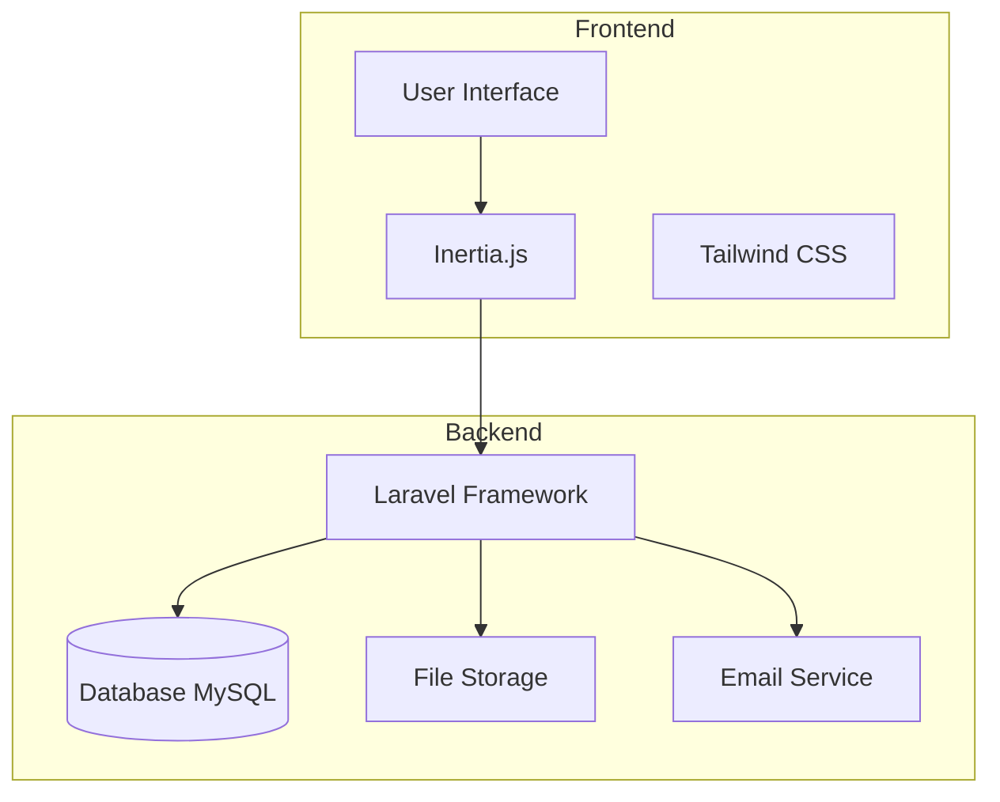
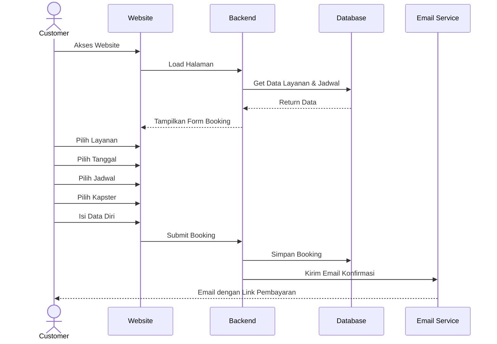
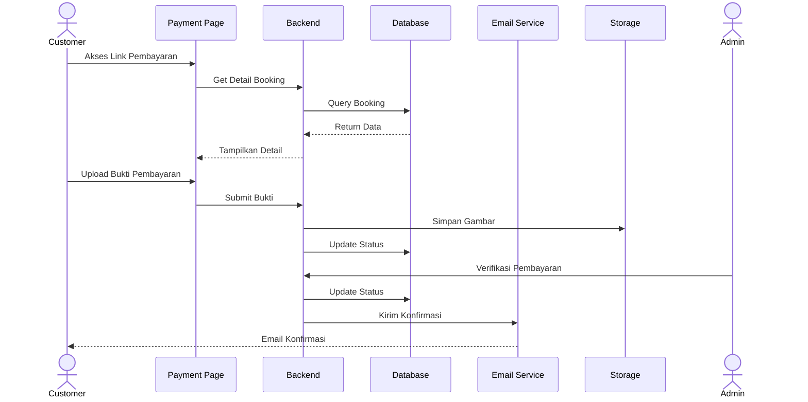
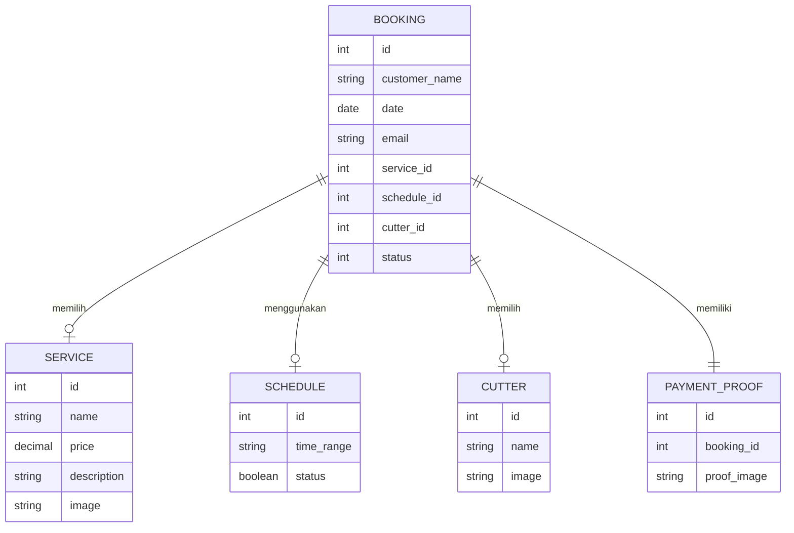
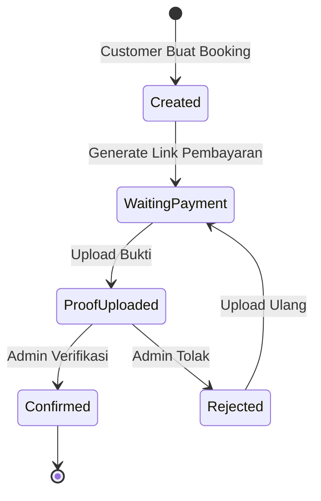
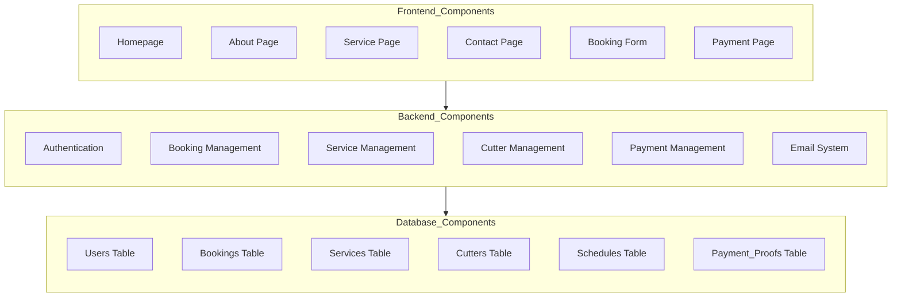
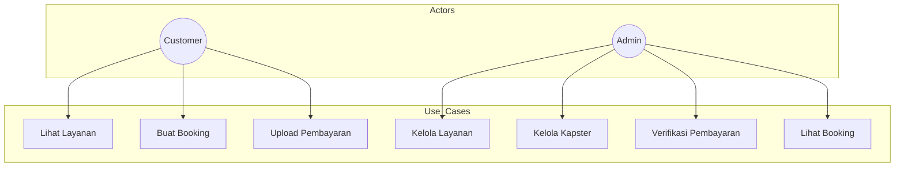
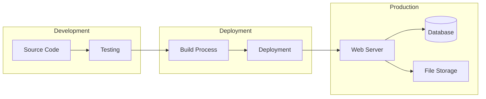

# Dokumentasi Diagram Sistem Barbershopku

## 1. Arsitektur Sistem


## 2. Alur Booking Customer


## 3. Alur Pembayaran


## 4. Entity Relationship Diagram


## 5. State Diagram Booking


## 6. Komponen Sistem


## 7. Use Case Diagram


## 8. Deployment Flow


## Panduan Presentasi

### 1. Pengenalan Sistem (3-5 menit)
- Jelaskan latar belakang masalah
- Tunjukkan diagram arsitektur sistem
- Jelaskan teknologi yang digunakan

### 2. Demo Fitur Utama (5-7 menit)
- Tunjukkan alur booking (gunakan diagram sequence)
- Demo proses pembayaran
- Tunjukkan sistem notifikasi

### 3. Aspek Teknis (5-7 menit)
- Jelaskan struktur database (gunakan ERD)
- Tunjukkan state diagram untuk alur booking
- Jelaskan komponen sistem

### 4. Keamanan dan Validasi (3-5 menit)
- Jelaskan sistem autentikasi
- Tunjukkan validasi input
- Jelaskan penanganan file

### 5. Pengembangan Lanjutan (2-3 menit)
- Tunjukkan deployment flow
- Jelaskan potensi pengembangan
- Diskusikan keterbatasan sistem

### Tips Presentasi:
1. Mulai dengan use case diagram untuk memberikan gambaran umum
2. Gunakan sequence diagram untuk menjelaskan alur detail
3. Tunjukkan ERD saat menjelaskan struktur data
4. Gunakan state diagram untuk menjelaskan status booking
5. Akhiri dengan deployment flow untuk aspek teknis

# Penjelasan Implementasi Kode

## 1. Arsitektur Sistem - Implementasi

### Frontend (Inertia + Vue)
```typescript
// resources/js/Pages/Booking.vue
export default {
    data() {
        return {
            services: [],
            schedules: [],
            cutters: []
        }
    },
    // Ini menunjukkan integrasi Inertia dengan Laravel
    mounted() {
        // Data dari Laravel controller diakses langsung sebagai props
        this.services = this.props.services;
        this.schedules = this.props.schedules;
        this.cutters = this.props.cutters;
    }
}
```

### Backend (Laravel)
```php
// routes/web.php - Definisi Route
Route::get('/booking/create', [BookingController::class, 'create'])->name('booking.create');
Route::post('/booking/store', [BookingController::class, 'store'])->name('booking.store');

// app/Http/Controllers/BookingController.php - Controller
public function create()
{
    $services = Service::all();
    $schedules = Schedule::all();
    $cutters = Cutter::all();

    return Inertia::render('Booking', [
        'services' => $services,
        'schedules' => $schedules,
        'cutters' => $cutters
    ]);
}
```

## 2. Alur Booking - Implementasi

### Step 1: Form Booking
```php
// app/Http/Controllers/BookingController.php
public function store(Request $request)
{
    // Validasi input
    $request->validate([
        'customer_name' => 'required|string|max:255',
        'date' => 'required|date',
        'email' => 'required|email|max:255',
        'service_id' => 'required|exists:services,id',
        'schedule_id' => 'required|exists:schedules,id',
        'cutter_id' => 'required|exists:cutters,id'
    ]);

    // Simpan booking
    $booking = Booking::create([...]);
}
```

### Step 2: Email Notifikasi
```php
// Implementasi pengiriman email
$client = new Client();
$response = $client->post('http://103.87.67.71:7001/email/send', [
    'json' => [
        'to' => $request->email,
        'subject' => 'BOOKING BARBERSHOP',
        'text' => "Booking Anda telah diterima..."
    ]
]);
```

## 3. Alur Pembayaran - Implementasi

### Upload Bukti Pembayaran
```php
// app/Http/Controllers/CustomerController.php
public function submitProof(Request $request, $bookingId)
{
    $request->validate([
        'proof_image' => 'required|image',
    ]);

    $imagePath = $image->store('payment_proofs', 'public');
    
    PaymentProof::create([
        'booking_id' => $bookingId,
        'proof_image' => $imagePath,
    ]);
}
```

### Verifikasi Pembayaran
```php
// app/Http/Controllers/BookingController.php
public function confirmPayment($bookingId)
{
    $booking = Booking::find($bookingId);
    $booking->status = 2; // Status konfirmasi
    $booking->save();
    
    // Kirim email konfirmasi
    // ... kode email ...
}
```

## 4. Entity Relationship - Implementasi

### Model Relationships
```php
// app/Models/Booking.php
class Booking extends Model
{
    public function service()
    {
        return $this->belongsTo(Service::class);
    }

    public function schedule()
    {
        return $this->belongsTo(Schedule::class);
    }

    public function cutter()
    {
        return $this->belongsTo(Cutter::class);
    }

    public function paymentProof()
    {
        return $this->hasOne(PaymentProof::class);
    }
}
```

## 5. State Booking - Implementasi

### Status Management
```php
// Contoh penggunaan status dalam BookingController
public function store(Request $request)
{
    $booking = Booking::create([
        // ...other fields...
        'status' => 1, // Status awal: Menunggu pembayaran
    ]);
}

public function confirmPayment($bookingId)
{
    $booking = Booking::find($bookingId);
    $booking->status = 2; // Status: Pembayaran dikonfirmasi
    $booking->save();
}
```

## 6. Komponen Sistem - Implementasi

### Frontend Components
```vue
// resources/js/Pages/Admin/Booking/Index.vue
<template>
    <div>
        <table>
            <tr v-for="booking in bookings" :key="booking.id">
                <td>{{ booking.customer_name }}</td>
                <td>{{ booking.service.name }}</td>
                <td>{{ booking.schedule.time_range }}</td>
                <!-- ... -->
            </tr>
        </table>
    </div>
</template>
```

### Backend Components
```php
// app/Http/Controllers/ServiceController.php
class ServiceController extends Controller
{
    public function index()
    {
        $services = Service::all();
        return Inertia::render('Admin/Service/Index', [
            'services' => $services
        ]);
    }
    // ... CRUD methods ...
}
```

## 7. Use Cases - Implementasi

### Customer Use Cases
```php
// routes/web.php
Route::get('/', [ContentController::class, 'home'])->name('home');
Route::get('/booking/create', [BookingController::class, 'create']);
Route::post('/payment/submit/{id}', [CustomerController::class, 'submitProof']);
```

### Admin Use Cases
```php
// routes/web.php
Route::middleware('auth')->group(function () {
    Route::resource('cutters', CutterController::class);
    Route::resource('services', ServiceController::class);
    Route::patch('/payment/confirm/{id}', [BookingController::class, 'confirmPayment']);
});
```

## 8. Deployment - Implementasi

### File Structure
```
barbershopku/
├── app/
│   ├── Http/Controllers/
│   ├── Models/
│   └── ...
├── resources/
│   ├── js/
│   └── ...
├── routes/
│   └── web.php
├── public/
└── storage/
    └── app/public/
        ├── payment_proofs/
        └── services/
```

## Tips Presentasi Teknis:

1. **Saat Menjelaskan Arsitektur:**
   - Tunjukkan file `routes/web.php` untuk menjelaskan endpoint
   - Tunjukkan controller untuk logika bisnis
   - Tunjukkan Vue components untuk UI

2. **Saat Demo Booking:**
   - Mulai dari route (`web.php`)
   - Tunjukkan controller (`BookingController.php`)
   - Tunjukkan view (`resources/js/Pages/Booking.vue`)
   - Tunjukkan model (`app/Models/Booking.php`)

3. **Saat Menjelaskan Database:**
   - Tunjukkan model relationships
   - Tunjukkan migration files
   - Jelaskan alasan pemilihan struktur

4. **Saat Demo Pembayaran:**
   - Tunjukkan proses upload file
   - Tunjukkan sistem notifikasi email
   - Tunjukkan status management

5. **Saat Menjelaskan Keamanan:**
   - Tunjukkan validasi input
   - Tunjukkan middleware auth
   - Tunjukkan file handling
