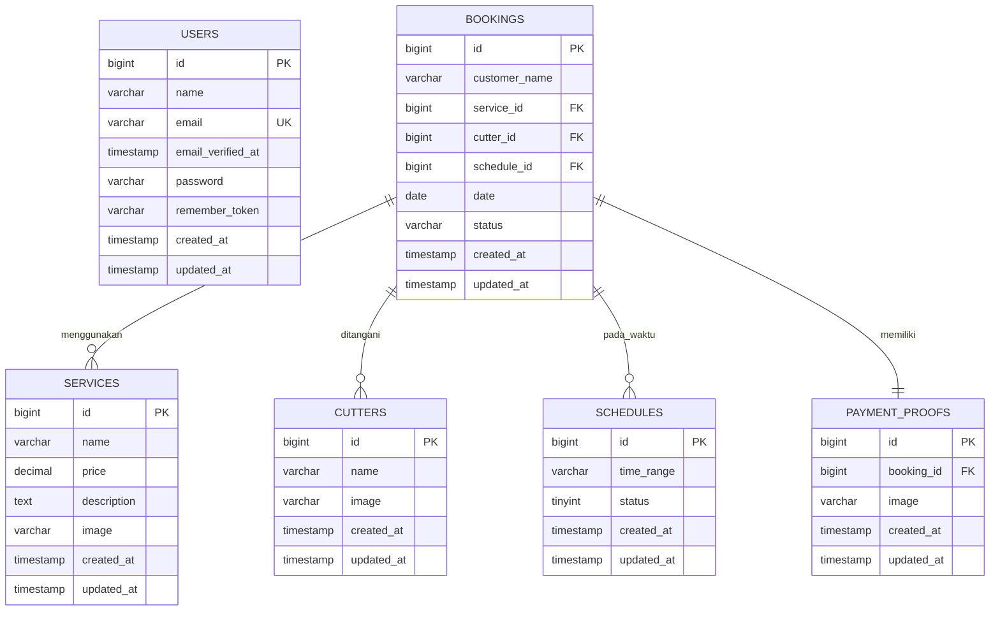
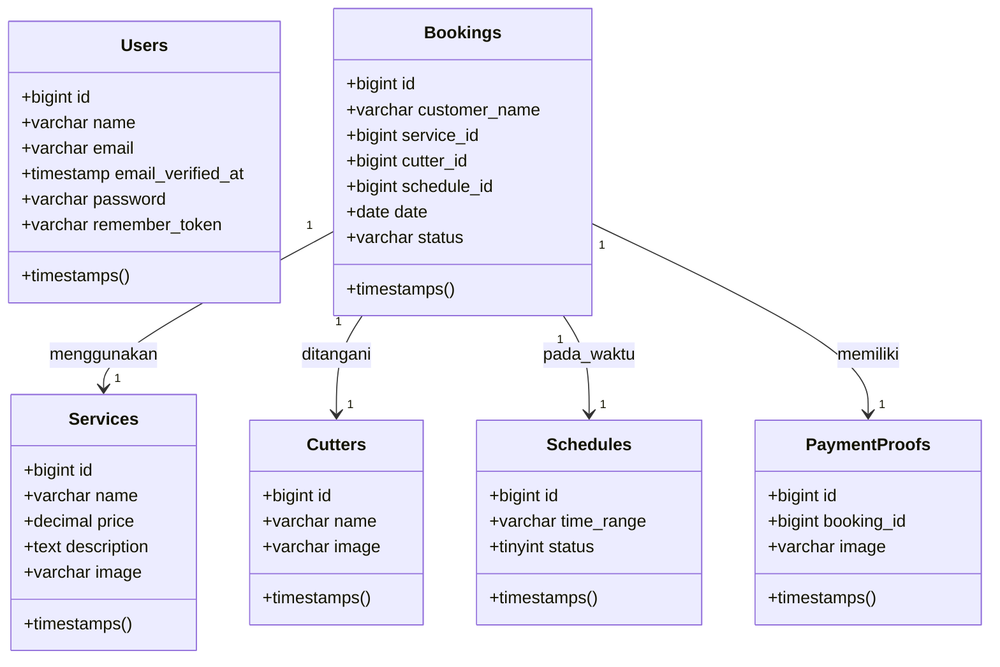
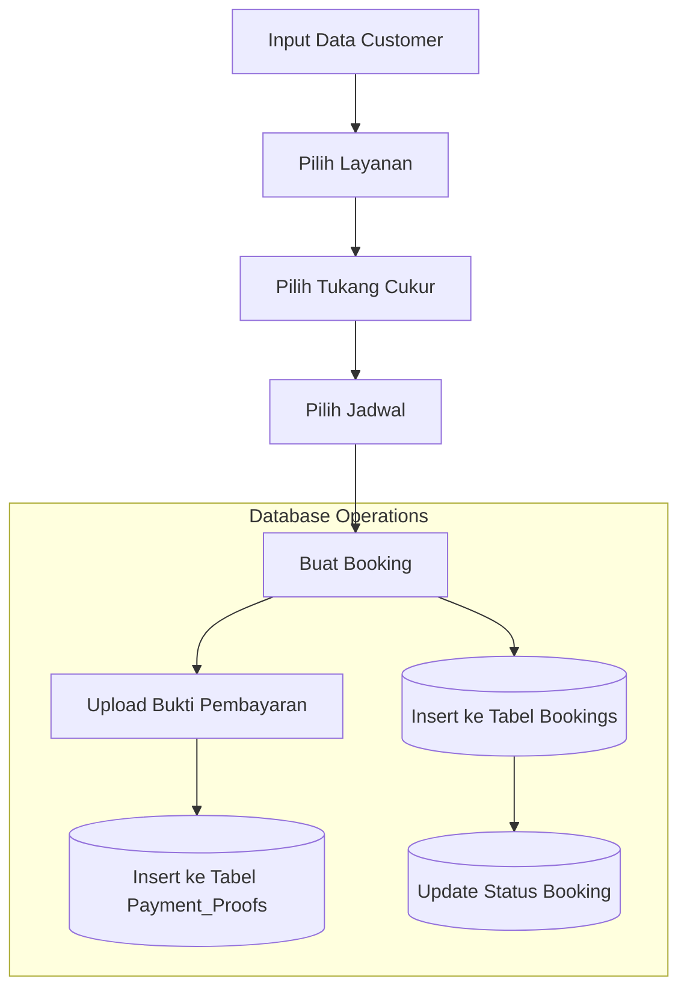
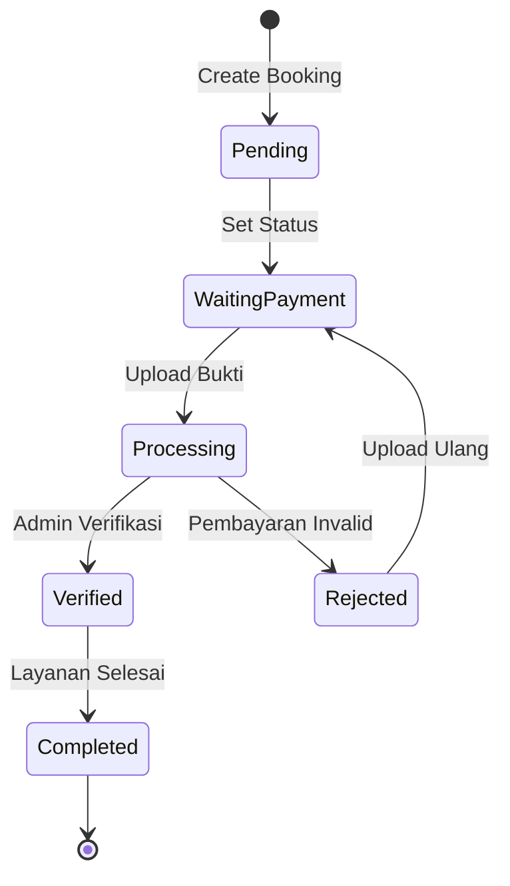
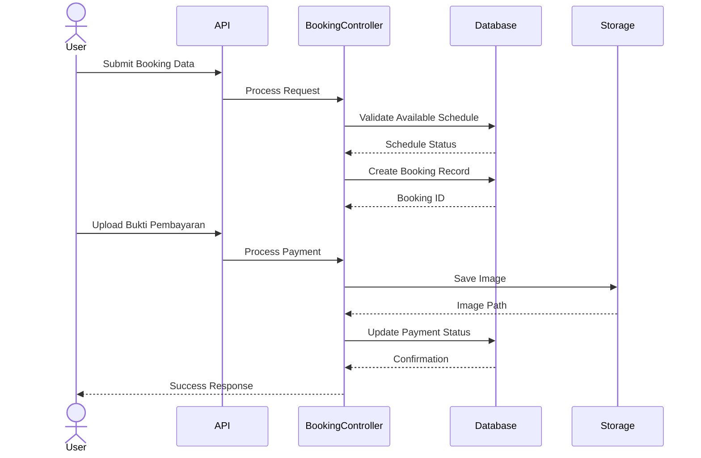
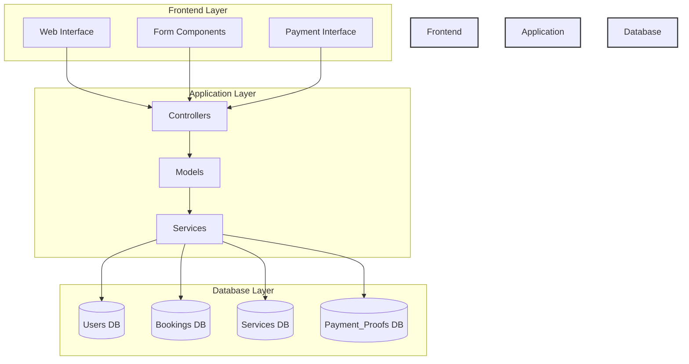
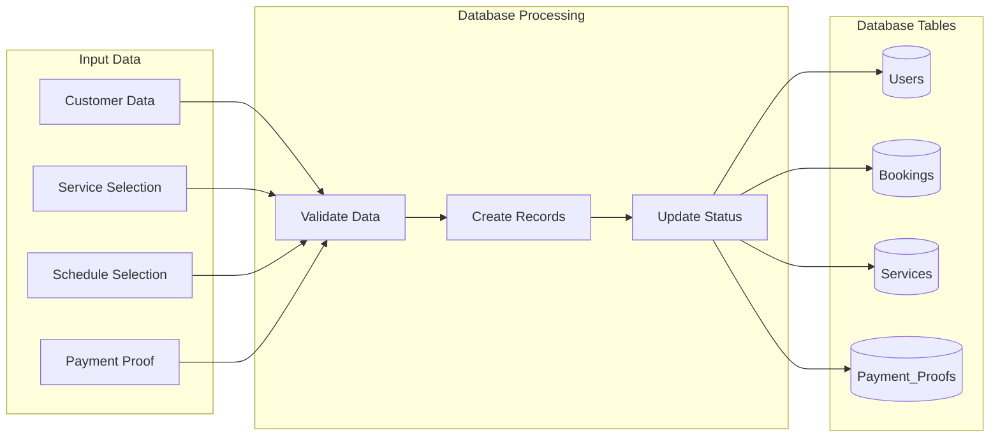

# Dokumentasi Visual Database Barbershopku

## Pengantar
"Selamat pagi/siang Bapak/Ibu dosen penguji. Pada kesempatan ini, saya akan menjelaskan struktur database dari sistem Barbershop yang saya kembangkan. Database ini dirancang menggunakan MySQL dengan framework Laravel, yang memungkinkan pengelolaan data yang efisien dan aman untuk operasional barbershop online."

## A. Penjelasan Struktur Database

### 1. Tabel dan Relasinya

#### a) Tabel Users (Pengguna)
- **Struktur:**
  ```sql
  - id: Primary Key, auto-increment untuk identifikasi unik
  - name: Nama lengkap pengguna
  - email: Email unik untuk autentikasi
  - email_verified_at: Timestamp verifikasi email
  - password: Hash password menggunakan bcrypt
  - remember_token: Token untuk fitur "Remember Me"
  - created_at & updated_at: Audit trail
  ```
- **Kegunaan:**
  - Menyimpan data pengguna sistem
  - Mendukung sistem autentikasi
  - Memungkinkan tracking aktivitas user

#### b) Tabel Services (Layanan)
- **Struktur:**
  ```sql
  - id: Primary Key, auto-increment
  - name: Nama layanan
  - price: Harga dengan decimal(8,2)
  - description: Deskripsi layanan
  - image: Path gambar layanan
  - created_at & updated_at: Audit trail
  ```
- **Kegunaan:**
  - Katalog layanan barbershop
  - Manajemen harga dan deskripsi
  - Visualisasi layanan dengan gambar

#### c) Tabel Cutters (Tukang Cukur)
- **Struktur:**
  ```sql
  - id: Primary Key, auto-increment
  - name: Nama tukang cukur
  - image: Foto profil
  - created_at & updated_at: Audit trail
  ```
- **Kegunaan:**
  - Manajemen tukang cukur
  - Profil dan keahlian
  - Tracking kinerja

#### d) Tabel Schedules (Jadwal)
- **Struktur:**
  ```sql
  - id: Primary Key, auto-increment
  - time_range: Slot waktu tersedia
  - status: Status ketersediaan (0/1)
  - created_at & updated_at: Audit trail
  ```
- **Kegunaan:**
  - Manajemen slot waktu
  - Pencegahan booking ganda
  - Optimasi jadwal

#### e) Tabel Bookings (Pemesanan)
- **Struktur:**
  ```sql
  - id: Primary Key, auto-increment
  - customer_name: Nama pelanggan
  - service_id: Foreign Key ke Services
  - cutter_id: Foreign Key ke Cutters
  - schedule_id: Foreign Key ke Schedules
  - date: Tanggal booking
  - status: Status pemesanan
  - created_at & updated_at: Audit trail
  ```
- **Kegunaan:**
  - Pusat data transaksi
  - Tracking status pemesanan
  - Relasi dengan entitas terkait

#### f) Tabel Payment_Proofs (Bukti Pembayaran)
- **Struktur:**
  ```sql
  - id: Primary Key, auto-increment
  - booking_id: Foreign Key ke Bookings
  - image: Path bukti pembayaran
  - created_at & updated_at: Audit trail
  ```
- **Kegunaan:**
  - Verifikasi pembayaran
  - Dokumentasi transaksi
  - Audit keuangan

### 2. Relasi Antar Tabel

#### a) One-to-Many Relations
1. **Services -> Bookings**
   - Satu layanan dapat dipesan berkali-kali
   - Menggunakan foreign key service_id
   - Integritas referensial dengan ON DELETE RESTRICT

2. **Cutters -> Bookings**
   - Satu tukang cukur dapat menangani banyak booking
   - Menggunakan foreign key cutter_id
   - Tracking beban kerja tukang cukur

3. **Schedules -> Bookings**
   - Satu jadwal dapat digunakan untuk beberapa booking
   - Menggunakan foreign key schedule_id
   - Manajemen ketersediaan waktu

#### b) One-to-One Relations
1. **Bookings -> Payment_Proofs**
   - Setiap booking memiliki satu bukti pembayaran
   - Menggunakan foreign key booking_id
   - Memastikan integritas data pembayaran

### 3. Normalisasi Database

#### First Normal Form (1NF)
- Setiap kolom berisi nilai atomik
- Tidak ada repeating groups
- Primary key unik untuk setiap record

#### Second Normal Form (2NF)
- Memenuhi 1NF
- Semua non-key attributes tergantung pada entire primary key

#### Third Normal Form (3NF)
- Memenuhi 2NF
- Tidak ada transitive dependencies

## B. Implementasi dan Optimasi

### 1. Indexing Strategy
- **Primary Keys:** Auto-increment untuk efisiensi
- **Foreign Keys:** Index untuk mempercepat joins
- **Frequently Searched:** Index pada kolom yang sering dicari

### 2. Query Optimization
- Prepared statements untuk security
- Eager loading untuk menghindari N+1 problems
- Query caching untuk data statis

### 3. Data Integrity
- Foreign key constraints
- Unique constraints pada email
- Not null constraints pada field penting

### 4. Security Measures
- Password hashing dengan bcrypt
- Prepared statements mencegah SQL injection
- Input validation di aplikasi layer

## C. Maintenance dan Backup

### 1. Backup Strategy
- Daily automated backups
- Point-in-time recovery capability
- Offsite backup storage

### 2. Performance Monitoring
- Query performance logging
- Resource usage tracking
- Regular optimization

### 3. Scaling Considerations
- Vertical scaling untuk traffic rendah
- Horizontal scaling untuk future growth
- Caching strategy implementation

## D. Pengembangan Masa Depan

### 1. Planned Improvements
- Rating system untuk tukang cukur
- Loyalty points system
- Advanced booking analytics

### 2. Potential Extensions
- Multi-cabang support
- API integration capabilities
- Enhanced reporting features

## E. Tips Menjawab Pertanyaan Penguji

### 1. Tentang Struktur Database
- Jelaskan alasan pemilihan tipe data
- Bahas normalisasi yang diterapkan
- Tunjukkan pertimbangan scalability

### 2. Tentang Performa
- Jelaskan strategi indexing
- Bahas query optimization
- Jelaskan handling concurrent users

### 3. Tentang Keamanan
- Bahas enkripsi data sensitif
- Jelaskan pencegahan SQL injection
- Tunjukkan validasi input

### 4. Tentang Maintenance
- Jelaskan backup strategy
- Bahas monitoring system
- Tunjukkan update procedure

## F. Kesimpulan

"Database sistem Barbershop ini dirancang dengan mempertimbangkan:
1. Reliability: Menjaga integritas dan konsistensi data
2. Security: Implementasi best practices keamanan
3. Performance: Optimasi untuk kecepatan akses
4. Scalability: Kemampuan berkembang sesuai kebutuhan
5. Maintainability: Kemudahan dalam pemeliharaan

Sistem ini siap mendukung operasional barbershop dengan efektif dan dapat diandalkan."

## 1. Entity Relationship Diagram (ERD)


**Penjelasan ERD:**
"Mari kita mulai dengan Entity Relationship Diagram atau ERD. Diagram ini menggambarkan struktur utama database sistem kita.

1. **Tabel Users (Pengguna)**
   - "Di sini kita memiliki tabel Users yang menyimpan data pengguna sistem. Setiap user memiliki ID unik sebagai primary key, dan email yang bersifat unique key untuk mencegah duplikasi akun."
   - "Kita menggunakan fitur email_verified_at untuk memastikan validitas email pengguna, dan password yang terenkripsi untuk keamanan."

2. **Tabel Services (Layanan)**
   - "Tabel Services menyimpan berbagai layanan yang ditawarkan barbershop. Setiap layanan memiliki nama, harga yang menggunakan tipe decimal(8,2) untuk akurasi perhitungan, dan gambar yang disimpan sebagai path URL."

3. **Tabel Cutters (Tukang Cukur)**
   - "Untuk tukang cukur, kita memiliki tabel Cutters yang menyimpan informasi seperti nama dan foto. Sederhana tapi efektif untuk manajemen SDM."

4. **Relasi antar Tabel**
   - "Yang menarik di sini adalah bagaimana tabel Bookings menjadi pusat dari sistem. Perhatikan bagaimana satu booking terhubung dengan service, cutter, dan schedule menggunakan foreign keys."
   - "Relasi ||--o{ menunjukkan hubungan one-to-many, artinya satu service bisa digunakan di banyak booking."
   - "Khusus untuk PaymentProofs, kita menggunakan relasi one-to-one (||--||) karena satu booking hanya memiliki satu bukti pembayaran."

## 2. Database Schema Diagram


**Penjelasan Schema:**
"Selanjutnya, mari kita lihat schema database dalam bentuk class diagram.

1. **Timestamps**
   - "Perhatikan bahwa setiap tabel memiliki timestamps() yang mencakup created_at dan updated_at. Ini penting untuk audit trail dan tracking perubahan data."

2. **Tipe Data**
   - "Pemilihan tipe data sangat krusial. Misalnya, untuk status kita gunakan tinyint(1) yang hanya membutuhkan 1 byte storage, sangat efisien untuk data boolean."
   - "Untuk harga, kita gunakan decimal untuk menghindari masalah floating point yang biasa terjadi dengan float atau double."

## 3. Alur Data Booking


**Penjelasan Alur:**
"Diagram ini menunjukkan flow data dalam proses booking.

1. **Input dan Validasi**
   - "Proses dimulai dari input data customer. Setiap input akan divalidasi sebelum masuk ke database."
   - "Sistem akan mengecek ketersediaan jadwal dan tukang cukur secara real-time."

2. **Database Operations**
   - "Perhatikan bagaimana setiap langkah terhubung dengan operasi database spesifik."
   - "Kita menggunakan transaction untuk memastikan integritas data saat melakukan multiple insert."

## 4. State Diagram Status Booking


**Penjelasan Status:**
"State diagram ini sangat penting untuk memahami lifecycle sebuah booking.

1. **Status Transitions**
   - "Booking dimulai dari status Pending saat pertama dibuat."
   - "Setelah pembayaran diupload, status berubah ke Processing untuk verifikasi admin."
   - "Jika pembayaran valid, status menjadi Verified, jika tidak menjadi Rejected."

2. **Error Handling**
   - "Sistem memungkinkan upload ulang jika pembayaran ditolak."
   - "Setiap perubahan status tercatat dalam database dengan timestamp."

## 5. Sequence Diagram Database Operations


**Penjelasan Sequence:**
"Sequence diagram ini menunjukkan interaksi detail antara komponen sistem.

1. **Validasi dan Penyimpanan**
   - "Setiap request melalui proses validasi berlapis."
   - "Storage handling untuk bukti pembayaran dilakukan secara terpisah dari operasi database utama."

2. **Response Handling**
   - "Sistem memberikan feedback real-time di setiap tahap."
   - "Error handling diimplementasi di setiap layer untuk reliability."

## 6. Database Component Integration


**Penjelasan Integrasi:**
"Mari kita lihat bagaimana database terintegrasi dengan komponen lain.

1. **Layer Architecture**
   - "Sistem menggunakan three-tier architecture untuk separation of concerns."
   - "Database layer terisolasi dan hanya bisa diakses melalui Models dan Services."

2. **Security**
   - "Akses ke database selalu melalui prepared statements untuk mencegah SQL injection."
   - "Implementasi middleware auth untuk mengamankan endpoint sensitif."

## 7. Data Flow Diagram


**Penjelasan Data Flow:**
"Terakhir, mari kita lihat bagaimana data mengalir dalam sistem.

1. **Input Processing**
   - "Semua input user melalui proses validasi terpusat."
   - "Data sensitif seperti password tidak pernah disimpan dalam bentuk plain text."

2. **Data Consistency**
   - "Foreign key constraints menjaga integritas referensial."
   - "Indexing diimplementasi untuk optimasi query performance."

## Kesimpulan
"Demikian penjelasan tentang struktur database sistem Barbershop ini. Database dirancang dengan mempertimbangkan:
1. Scalability untuk pengembangan masa depan
2. Data integrity melalui relasi dan constraints
3. Security dengan implementasi best practices
4. Performance melalui optimasi struktur dan query
5. Maintainability dengan dokumentasi yang jelas

Apakah ada pertanyaan terkait struktur atau implementasi database ini?"

## Tips Menjawab Pertanyaan Penguji:

1. **Tentang Relasi:**
   - Jelaskan alasan pemilihan tipe relasi (one-to-one, one-to-many)
   - Tunjukkan bagaimana foreign keys menjaga integritas data
   - Jelaskan normalisasi yang diterapkan

2. **Tentang Performa:**
   - Jelaskan strategi indexing
   - Bahas optimasi query yang dilakukan
   - Jelaskan handling untuk concurrent users

3. **Tentang Keamanan:**
   - Jelaskan mekanisme enkripsi password
   - Bahas pencegahan SQL injection
   - Jelaskan management user access

4. **Tentang Skalabilitas:**
   - Jelaskan bagaimana struktur mendukung penambahan fitur
   - Bahas potential bottlenecks dan solusinya
   - Jelaskan strategi backup dan maintenance

## Panduan Presentasi Database

### 1. Struktur Database (3-5 menit)
- Gunakan ERD untuk menjelaskan struktur tabel
- Jelaskan relasi antar tabel
- Tunjukkan primary dan foreign keys

### 2. Alur Data (3-4 menit)
- Gunakan Flow Diagram untuk menjelaskan proses
- Tunjukkan bagaimana data mengalir
- Jelaskan proses validasi

### 3. Status dan State (2-3 menit)
- Gunakan State Diagram untuk status booking
- Jelaskan transisi antar status
- Tunjukkan penanganan error

### 4. Integrasi Sistem (2-3 menit)
- Gunakan Component Diagram
- Jelaskan interaksi antar layer
- Tunjukkan security measures

### Tips Presentasi Database:
1. Mulai dengan ERD untuk gambaran struktur
2. Gunakan alur data untuk menjelaskan proses
3. Tunjukkan state diagram untuk logika status
4. Akhiri dengan integrasi sistem 